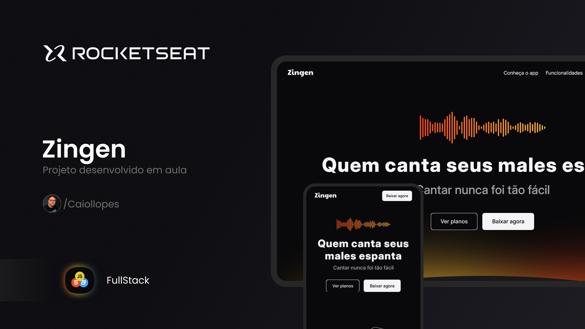

<h1 align="center"> Zingen </h1>

 

  

## 💻 Projeto

Zingen é um projeto desenvolvido em aula para praticar o que aprendi e desenvolvi.

## 📚 Aprendizado

Neste projeto eu aprendi:

- CSS Functions
  - Transform (translate, rotate e scale)
  - Color
  - Gradient
  - Shape

- CSS Media Queries

## 🚀 Tecnologias

Esse projeto foi desenvolvido com as seguintes tecnologias:

- HTML e CSS
- Git e Github
- Figma

## 🔖 Web site

Você pode visualizar este projeto 
<a href="https://caiollopes.github.io/zingen-rks/" target="_blank">Clicando aqui!</a>
